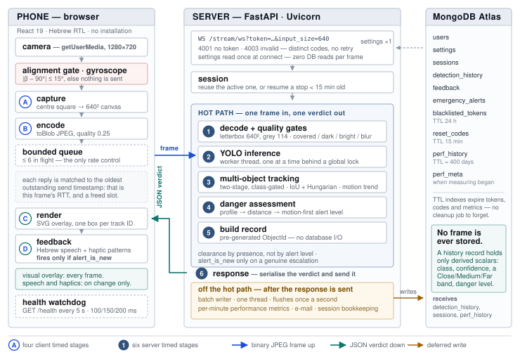

# Chapter 3 — System Design and Implementation

This chapter is the technical core. §3.1 presents the architecture and follows a single frame
through the system; §3.2 documents the data pipeline that produced the final 91,139-image
dataset; §3.3 the four stages of model development; §3.4 and §3.5 the server and client;
§3.6 deployment and evaluation methodology.

## 3.1 System Architecture

SeeSense is a three-tier system: a browser-based client on the user's phone, a Python inference
and application server, and a document database.

> **Figure 3.1** — SeeSense architecture and the life of one frame. The phone runs four timed
> stages (A–D) and the server six (1–6): five operations between the frame arriving and the
> verdict being decided, plus the serialisation and send. Everything the system does that is *not*
> one of those ten — the batched database write, e-mail, metric persistence and session
> bookkeeping — happens only after the verdict has already gone out.

**Design principles.** *One hot path, everything else off it* — exactly five operations happen
between a frame arriving and the verdict being decided, and a sixth timed stage covers
serialising and sending it; database writes, e-mail, metric persistence and
session bookkeeping all run on background threads after the response is sent. *State in memory,
durability in Mongo* — settings, tracker state, the last danger flag and the last announced alert
level per track live in process memory and are read every frame; this one decision is worth 71 ms
per frame (§4.4). *The client is not a dumb camera* — alignment, backpressure, health monitoring,
Hebrew speech composition and alert-channel policy live on the phone; the server returns facts
about the scene, the client decides how to express them. *The server never blocks its own event
loop* — §5.3 documents what happened the two times we got this wrong.

**The life of one frame.** On the phone, a high-frequency poll timer (120 Hz) fires and first
evaluates a cheap boolean — scanning, aligned, socket open, free in-flight slot — so a frame
that would be discarded costs nothing. Otherwise the video is drawn into an offscreen square
canvas at the negotiated input size (`capture`), encoded to a JPEG Blob (`encode`), the conditions
re-checked, and the Blob written to the socket with a send timestamp pushed onto a FIFO.

On the server: `decode_image()` rejects payloads under 1,000 bytes, decodes, checks the original's
longest side is ≥ 120 px, letterbox-resizes to the connection's input size with grey padding, and
applies four quality gates (`decode_quality`). The image goes to the detector through
`asyncio.to_thread`, serialised behind a global lock, and results are parsed with any unsupported
class dropped (`inference`). The per-user tracker associates detections in two stages and enriches
each with a motion block (`tracking`). `assess_danger()` applies the sensitivity profile, converts
area ratio to a distance category and box centre to a position, classifies each object's alert
level, and rolls up a frame verdict (`danger_logic`). A detection record is built with a
**pre-generated ObjectId** so its identifier can be returned before anything is written
(`db_write` — no I/O). Two service calls then determine what the client should *do*:
`evaluate_presence()` decides clearance by whether every object the system had engaged with has
actually left the frame — not by the alert level, because a hazard that merely stops moving is
still in the path — and also surfaces a one-shot notice for a watched object confirmed
motionless; `has_new_alert()` returns true only when some track's alert level genuinely
escalated. The verdict is sent; the record and the session's frame count are then handed to a
batch writer that flushes to the database once a second on a single background thread.

Back on the phone, the result is matched to the oldest outstanding send timestamp — yielding this
frame's round-trip time and freeing a slot, which immediately permits the next capture. The
overlay is redrawn, one SVG rectangle per detection keyed by track ID so boxes animate rather than
remount (`render`). If `danger_cleared` is set, "נתיב פנוי" ("path clear") is spoken once. A
`static_notice` — a watched object confirmed motionless in the path — is phrased in Hebrew and
spoken once per still episode. Otherwise, **only if `alert_is_new`**, the haptic pattern fires and
the Hebrew utterance is spoken (`feedback`).

That asymmetry is the single most important design decision in the product. The visual overlay
updates on every frame, because a sighted observer samples what they want. The audio and haptic
channels fire only on *change*, because a human cannot — with one deliberate exception: while a
red-level danger is still approaching, the client re-announces the leading threat every two
seconds, because an ongoing threat must not fall silent merely for having been mentioned once.
§3.4.5 describes the deduplication that makes this possible.

**Technology choices.** React 19 + Vite 8 for the client, delivered as a mobile-first single-page
application over HTTPS so there is no installation and no app store — the adoption argument of
§2.1. WebSocket transport, binary
up and JSON down. FastAPI + Uvicorn for ASGI concurrency and Pydantic validation. PyTorch [41]
with Ultralytics for the model, sharing one label format across YOLOv8, YOLO11 and YOLO26. OpenCV and
NumPy for
image handling, with a letterbox implementation matching the training preprocessing exactly. SciPy
for optimal Hungarian assignment. MongoDB Atlas, whose TTL indexes expire revoked tokens and reset
codes without application code. JWT with bcrypt for authentication. Two deployments: Docker on
Railway as the CPU baseline, and a GPU-backed Google Cloud VM on which the same FastAPI process
serves the built client (§3.6.1). The Web Speech and Vibration APIs for output.

One choice deserves note: the client is a **Hebrew, right-to-left web application**, not a native
app, following directly from the accessibility argument — a blind user should not have to navigate
an app store, and a web application is instantly updatable and device-agnostic. The cost is that
two capabilities are unavailable on iOS: the Vibration API, and true background execution. Those
costs are documented in Table 5.1 rather than hidden.
