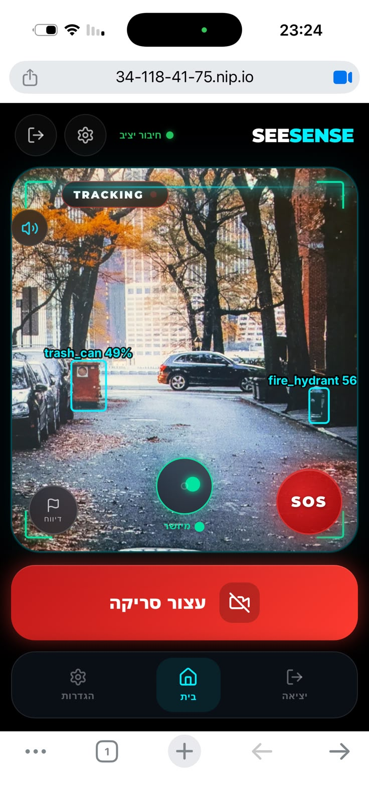
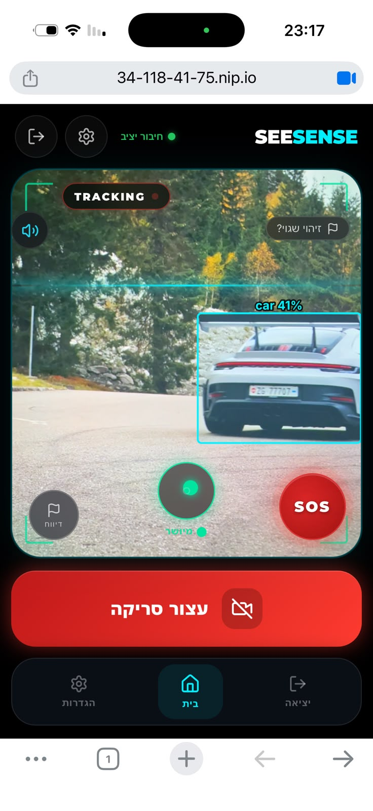
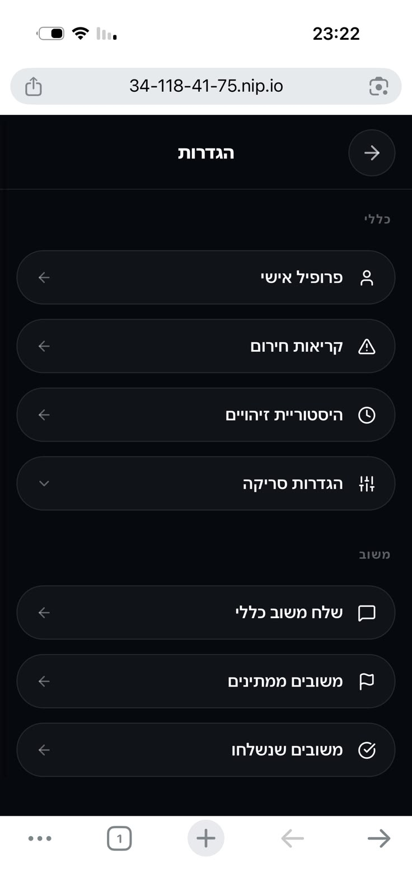
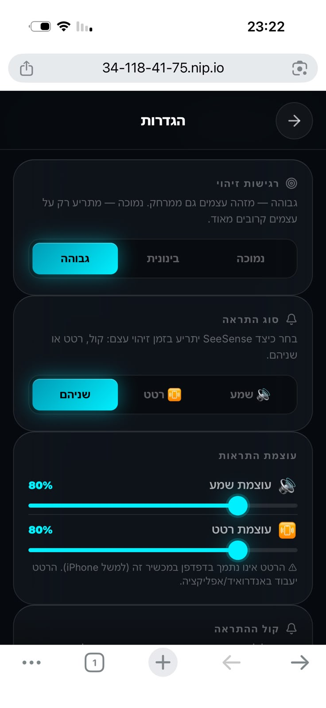

## 3.5 Client Implementation

The client is a mobile-first, right-to-left, Hebrew-language web application built in React and
served as a standard web page, so it opens in a phone browser with no installation and no app
store. It opens the rear camera, verifies that the phone is held correctly, streams frames to the
server, draws a live heads-up display, and converts the server's verdicts into Hebrew speech and
haptic vibration.

The governing design principle is that **for the primary user the visual layer is not the
interface; the audio and haptic channels are.** The screen exists for a sighted companion, for
configuration, and for the development team. Every mechanism described below that resembles polish
— throttling, deduplication, priority overrides, spoken confirmations of state changes — follows
from that principle. A screen can carry a redundant badge indefinitely at no cost, whereas a speech
channel that announces the same bench four times has, for that interval, become unusable for the
announcement that matters. The same principle sets the severity axis used in §3.5.8: for this user
the worst failure is not a broken layout but **silence**, because a system producing no sound is
indistinguishable from a clear path ahead.

Seventeen routes are defined — four public (login, registration, password recovery and reset) and
thirteen protected: the camera dashboard, settings, profile, emergency contacts, detection history,
SOS history, three feedback pages and four administrative pages. Administrative controls are hidden
from users who lack the corresponding permission level, but the **server** performs the actual
authorisation on every request; hiding a control is a usability courtesy, never a security
boundary.

### 3.5.1 Architecture and the streaming pipeline

The client maintains two channels to the server. Ordinary application data — authentication,
settings, history, feedback, emergency contacts — travels over REST. The detection pipeline uses a
single **WebSocket**, opened when the user starts a scan and closed when they stop it. Encoded
camera frames are sent as binary messages and detection results return as structured messages, so
no image is ever converted to text and no request overhead is paid per frame.

Three parameters govern the pipeline — the **input size** of the square frame sent for detection,
the **JPEG compression** applied to it, and the **pipeline depth**, meaning the number of frames
that may be outstanding at once. None is compiled into the application: the server transmits its
values in the connection acknowledgement and the client validates and adopts them for that session,
so the two sides can never disagree about the coordinate space a detection is expressed in, and an
administrator can retune them against a live deployment. Input size is the largest performance
lever in the system, because the detector runs at exactly that resolution and a smaller frame means
both a smaller upload and a faster forward pass; the CPU-era reduction and its reversal on the GPU
deployment are discussed in §4.4.1.

Pipeline depth is the only control on the send rate, and it is implemented as a **bounded in-flight
window with drop-on-full semantics — there is no frame queue anywhere in the client.** A frame is
captured only if a slot is free, and a slot is released the moment its result returns, so the
client transmits at whatever rate the network and the server can sustain. The alternative is worse:
a queue would absorb a slowdown by *delaying* frames, so a user walking through a congested network
would receive analyses of scenes they had already passed — the most dangerous failure available to
a navigation aid, because the output stays confident while becoming untrue. Dropping instead of
queueing means the system degrades by **saying less, never by saying something stale**. The
readiness check is applied twice, before image processing begins and again after encoding
completes, since conditions may change while the encoder runs, and a timeout reclaims any slot
whose result never arrives so that lost replies cannot silently stall the stream.

At the deployed depth the pipeline sustains roughly **50 FPS at 120–130 ms end-to-end**, measured
in §4.4.2 and Table 4.3. The client also reports round-trip time, end-to-end latency, achieved
frame rate, dropped frames and its own per-stage timings every five seconds, which is what makes
the unified latency breakdown of §4.4 possible. Reconnection distinguishes causes: a clean close is
final, a transient failure is retried a bounded number of times, and a rejected session terminates
the stream and signs the user out rather than replaying a dead credential.

### 3.5.2 Camera capture and orientation gating

The client requests the rear camera at a preferred resolution but treats the returned stream as
authoritative, deriving all geometry from the dimensions the device actually provides. Each frame
is cropped to a centre square, scaled to the model's input size and encoded as JPEG directly into a
binary buffer, which is handed to the socket without an intermediate text encoding. Pinch-to-zoom
between one and five times is supported; the client requests true hardware zoom where the camera
reports the capability and falls back to a scaling transform elsewhere. Detection boxes returned by
the server are mapped from model coordinates back into screen coordinates and drawn as an overlay,
each box tied to its tracking identity so that a tracked object retains a stable box across frames
rather than flickering.

**Orientation gating** is a correctness mechanism rather than an optimisation. Using the device
orientation sensor, the client considers the phone aligned when it is held upright within fifteen
degrees of vertical, and **no frames are transmitted while it is not.** A detector presented with a
photograph of the pavement or the sky returns confident and useless answers, and a user who cannot
see the frame has no way to notice the mistake; refusing to analyse such a frame is preferable to
announcing what it contains. On platforms that require explicit consent for motion data, the
permission is requested from within the start-scanning action, as those platforms only grant it in
response to a direct user gesture. The gate's behaviour on devices that report no orientation at
all is a documented limitation (§3.5.8).

### 3.5.3 Feedback: Hebrew speech and haptics

This layer is the product. The server returns structured fields — an object class, a bearing, an
alert level, a motion state — and the client composes every Hebrew utterance itself; the server's
own English message text is never read aloud. Presentation language is therefore entirely a client
concern, and phrases are constructed to tell the user *where to turn* rather than to restate what
the model saw: an approaching hazard is announced as a danger with the object and its bearing, and
a stationary object confirmed motionless is announced with the reassurance that it is not moving.
All seventeen detectable classes have Hebrew names, and an unrecognised class degrades to its raw
name rather than to silence.

**Speech is not a single channel but five, with deliberately different interruption rules**,
because the contention between two utterances is itself a safety decision:

| Path | Cooldown | Interrupts current speech? | Purpose |
|---|---|---|---|
| Standard alert | 3 s, overridable by a priority flag | yes | ordinary hazard announcements |
| Status and lifecycle | none | **no — queues** | paired messages that must be heard in order |
| Object announcement | 3 s, **applied per object class** | yes | naming detected objects |
| Voice preview | none | yes | auditioning a voice in settings |
| Mute announcement | none, and **ignores the mute setting** | yes | confirming that audio was turned off |

Three of those rows encode a specific insight. Lifecycle messages queue rather than cancel, which
is what allows a pair such as "scanning started" followed by "connected" to be heard in sequence
instead of the second erasing the first. The object cooldown is keyed to the object *class*, so a
car may interrupt an announcement about a bench while the same bench repeating may not — novelty is
measured per object type, not per utterance. And the mute confirmation deliberately bypasses the
audio gate it is reporting on, because a spoken "audio off" would otherwise be inaudible at exactly
the moment it carries information. That confirmation is also the one place the interface uses
vowel-pointed Hebrew, which constrains the synthesiser's reading of a word that is otherwise
ambiguous.

Voice selection accommodates a browser interface that populates asynchronously and varies by
device: the available voices are cached and refreshed as they arrive, filtered to Hebrew, and
matched to the user's preferred gender on a best-effort basis. Where a device offers only one
Hebrew voice, the settings page says so and explains that the gender control may have no audible
effect, rather than presenting a control that cannot work.

**Haptics** provide a parallel channel for users in noisy environments and a redundant one for
everybody. Five named patterns are used — scan start, scan stop, alignment regained, ordinary
detection, and danger — each a distinct rhythm rather than a distinct duration, so they remain
identifiable without being counted. Since the vibration interface accepts only durations and cannot
vary amplitude, the user's intensity setting scales the vibrating pulses while leaving the pauses
between them untouched; a danger pattern at low intensity therefore keeps its recognisable
five-part rhythm instead of degrading into what the user would perceive as a different signal. The
two alert patterns are rate-limited; the three lifecycle confirmations are not. Where the browser
provides no vibration support at all, the settings page states this plainly instead of offering an
inert control.

Volume, vibration intensity, channel selection (audio, haptic or both) and voice gender are stored
on the device and applied immediately, and synchronised to the user account when saved. Mute is
derived rather than stored as a separate flag: the system is muted precisely when the audio channel
would produce no sound. Consequently, unmuting restores both the volume and — if the user had
previously selected the haptic-only channel — the audio channel itself, closing the common defect
in which a user unmutes and still hears nothing.

### 3.5.4 Alert gating and deduplication

Because the audio channel is scarce, deciding *when not to speak* is as important as deciding what
to say. Each result is processed through an ordered set of rules that together constitute the
client's alert policy.

Visual state — the detection overlay, the alert level, the direction indicator — is updated on
every result, since it costs nothing and no rendering can mask another. Speech and haptics are
then gated. A "path clear" announcement is issued with priority whenever the server reports that a
danger has ended, because a user waiting to step off a kerb is waiting for exactly that utterance
and it must never be suppressed by a cooldown. A hazard that is present *and still approaching* is
re-announced every two seconds, deliberately bypassing the novelty rule below: an ongoing, closing
threat must not fall silent merely because it was announced once. In all other cases, **speech and
vibration are issued only when the server marks the alert as new.**

That last rule is the difference between an application that can be worn for an hour and one that
cannot be tolerated for a minute. An alert on every frame would be worse than no alert, because a
continuous stream of announcements masks the one that matters; deduplication is therefore not a
performance measure but the mechanism that keeps the primary output channel usable.

### 3.5.5 The heads-up display and emergency controls

The display is deliberately secondary, and its elements are individually classified for assistive
technology: hazard notifications are announced assertively, status changes politely, and purely
decorative layers are hidden from screen readers so that an animation is never narrated.

A **status badge** reports the session state as idle, live, or actively tracking, reinforced by
corner brackets that change colour as the scan starts and as alignment is achieved. A **spirit
level**, driven by the orientation sensor, shows how the phone is tilted, and a warning overlay
appears while the device is misaligned and frames are consequently not being sent. A **scanning
sweep animation is drawn only while frames are genuinely being transmitted**, so the one visual cue
most likely to be read as "it is working" cannot mislead. A **direction indicator** and a
full-viewport **alert overlay** communicate the current hazard and its bearing, and a **connection
health dot** reports link quality; its numeric latency readout is shown only to administrators,
because a millisecond figure a regular user cannot act upon is noise on a screen that must remain
scannable.

Two controls are always reachable. A **one-tap report button** files a wrong-detection report
against the most recent result, capturing that frame's context for later review, which is how the
feedback corpus described in §3.4 is populated during ordinary use. The **SOS button** sends an
emergency alert to the user's registered contacts and is a single tap — deliberately not a
long-press and not a gesture, both of which are harder to perform under stress. Location is
resolved in two stages: one high-accuracy attempt, then a faster attempt that will accept a
recently cached fix. If both fail the alert is still sent, **with no coordinates at all**. The
system never substitutes a placeholder position, since a fabricated coordinate produces a map link
that is confidently wrong, which is worse for a responding contact than an explicit "location
unavailable". Both outcomes are confirmed by speech and vibration.

{: .phone }
{: .phone }
{: .figpair }

> **Figure 3.7** — The dashboard during an active scan, captured on the deployed system. **Left:**
> two simultaneous detections (`trash_can`, `fire_hydrant`) drawn with their confidence scores;
> the `TRACKING` badge and green corner brackets indicate that the device is both scanning and
> aligned, the spirit level below reads "מיושר", and the health indicator reads "חיבור יציב".
> The report and SOS controls sit within thumb reach at the lower corners. **Right:** the scan
> sweep — drawn only while frames are actually being transmitted — crossing the viewport, with
> the "זיהוי שגוי?" prompt surfaced after an announcement so that a wrong detection can be
> reported in one tap.

### 3.5.6 Settings, session and state handling

The application uses no external state-management library. Feedback preferences are held on the
device so that they apply instantly and survive a reload, and are written to the user account when
the user saves; a page left with unsaved changes prompts explicitly rather than discarding them
silently. Detection sensitivity and the list of classes the user considers high-risk are stored on
the server, and because the server refreshes its cache on write, a change takes effect on the next
frame of a live session without reconnecting (§3.4).

Authentication state is restored from device storage on load, so a refresh does not interrupt a
session, and a periodic heartbeat maintains the presence information used by the administrative
views. Session expiry is handled through one shared path for both channels: an unauthorised REST
response and a rejected WebSocket session both terminate the stream, clear the stored credentials
and return the user to the login screen **with an explanation of why**, rather than presenting an
unexplained empty form. A burst of simultaneous failures produces one logout, not many.

All timestamps are normalised on receipt and rendered in a fixed timezone, so a recorded event
reads identically for every viewer regardless of device settings — a defect that previously caused
recent events to be displayed hours in the past.

{: .phone }
{: .phone }
{: .figpair }

> **Figure 3.8** — Settings. **Left:** the menu, from which the protected pages of §3.5 are
> reached. **Right:** the controls that govern the feedback channels — detection sensitivity,
> the audio/haptic/both channel selector, and the two intensity sliders. The notice beneath the
> vibration slider is generated from a capability check: rather than presenting a control that
> would silently do nothing, the page states that this browser provides no vibration support and
> names the platform on which it will work (§3.5.3).

### 3.5.7 Connection health monitoring

Because the system depends on a remote detector, link quality is itself safety-relevant, and the
client monitors it continuously during a scan by polling a lightweight server endpoint every five
seconds. A failed or timed-out poll is treated as the worst case rather than ignored, so a dead
network escalates through the same path as a very slow one instead of freezing the indicator on its
last good reading.

| State | Condition | Response |
|---|---|---|
| Good | latency below the first threshold | no announcement unless recovering from a degraded state |
| Unstable | first threshold exceeded on two consecutive polls | "החיבור לא יציב", announced once |
| Weak | second threshold exceeded on two consecutive polls | a spoken recommendation to move to an area with better reception |
| Lost | third threshold exceeded on three consecutive polls | danger vibration and "החיבור אבד" |

The design separates the two output channels by responsiveness. **The indicator reacts to every
reading, while the voice waits for a consecutive streak.** The dot therefore remains informative
without the audio channel commenting on every fluctuation, and requiring consecutive readings
prevents a single unlucky measurement from disrupting a healthy session, since mobile networks
routinely produce isolated outliers with nothing behind them. Each degradation is announced once;
recovery requires two consecutive good readings and names the state recovered to; and the all-clear
is only spoken if a degradation was announced in the first place.

One wording decision is deliberate. The lost-connection announcement states only that the
connection was lost and makes no claim about scanning having stopped, because it has not.
Informing a user who cannot see the screen that their scan has ended while it is in fact still
running is the worst possible direction for that error to point.

This is the monitoring half of the hybrid failover architecture described in §2.7. The
measurement, the thresholds and the user notification are implemented; the on-device model that
degradation would fail over *to* is not, which is why the system currently warns rather than
switching modes (§3.5.8).

### 3.5.8 Client limitations

A structured review of the client was carried out against the delivered code, and the four
limitations below are those with product-level consequences. They are stated in terms of the
severity axis introduced at the start of §3.5: a limitation that produces no sound is more serious
than one that produces a visible flaw, because only the latter is discoverable by the user.

**The alignment gate fails open on devices that do not report orientation.** The gate assumes an
upright device until told otherwise, so a phone with no orientation sensor, or one on which motion
permission was declined, is treated as permanently aligned: frames stream regardless of how the
device is held and the user is never prompted to straighten it. A related weakness is that the
misalignment prompt is visual only, so even where the gate works, a user who cannot see the screen
receives no frames and no explanation. Both are corrected by the same change — recording whether an
orientation reading has ever been received, and announcing the misaligned state aloud.

**The system depends entirely on network connectivity.** All detection is remote, so end-to-end
latency is bounded below by the round trip to the server and a degraded link degrades the product
directly. The watchdog of §3.5.7 measures and announces this, but it does not suspend scanning on a
lost connection, and there is no on-device model to fall back to. This is the largest architectural
constraint on the client and the subject of the offline-capability discussion in §6.3.

**The detection overlay mis-scales at high zoom levels.** The mapping from model coordinates to
screen coordinates is exact at the default zoom but over-scales as the view is magnified, so boxes
drift outward from centre. The consequence is contained — the overlay serves a sighted companion
and the development team, and neither the spoken output nor the hazard logic depends on it — but it
is a visible defect in the demonstrable surface of the product.

**There is no automated test suite and no top-level error recovery.** The client ships without
tests and without a boundary that would catch a rendering exception, so a fault in any page yields
a blank screen with no announcement — for this user, a completely silent failure. This is the most
valuable robustness addition available, and the recommended form is a boundary that *speaks* its
failure rather than merely displaying it (§6.3).

The same review produced a wider inventory of smaller defects and structural debt, none of which
affects the detection or feedback paths described above; these are recorded in the project
repository and summarised in Table 5.1.
